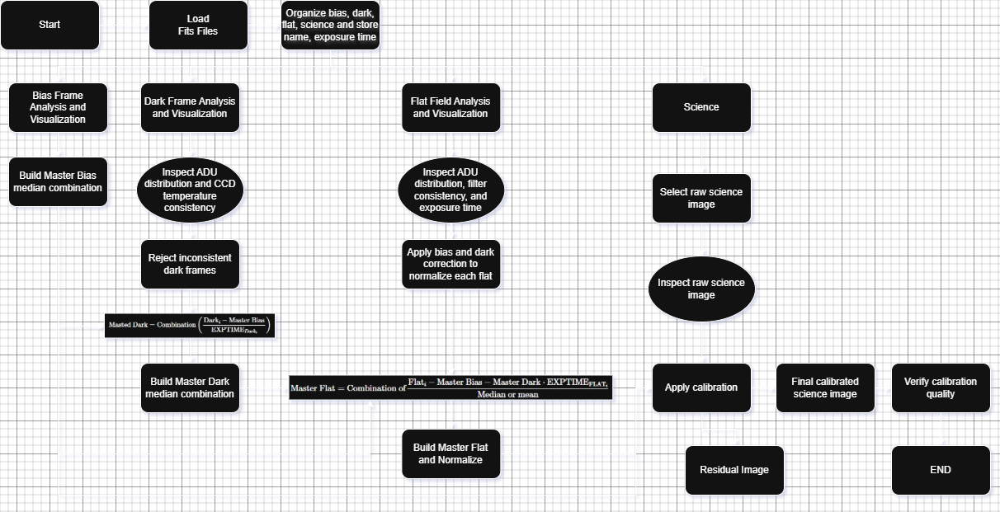

## Author

Iván Fridman  
Email: ifridman@usm.cl
GitHub: https://github.com/ivaniguess

## Project Overview
In this project, I present the implementation of image reduction techniques for astronomical images obtained with a CCD detector. The code focuses on calibrating raw science images by applying correction procedures of bias, dark, and flat field corrections. These standardized preprocessing steps are crucial for mitigating instrumental artifacts and thermal noise, thereby significantly improving the overall quality of the observations.

The implementation is carried out in Python using libraries such as astropy, numpy, and matplotlib.

The workflow diagram summarizes the full reduction process. 
1. Master bias creation
2. Master dark creation
3. Master flat creation
4. Calibration of science images

## References
Howell, S. B. (2006). Handbook of CCD astronomy (2nd ed.). Cambridge University Press.

https://docs.astropy.org/en/latest/io/fits/usage/image.html#scaleddata

https://learn.astropy.org/tutorials/FITS-images.html

https://matplotlib.org/stable/api/_as_gen/matplotlib.pyplot.imshow.html

https://docs.astropy.org/en/latest/io/fits/index.html

https://matplotlib.org/stable/api/_as_gen/matplotlib.pyplot.subplots.html

https://www.astropy.org/ccd-reduction-and-photometry-guide/v/dev/notebooks/00-00-Preface.html

